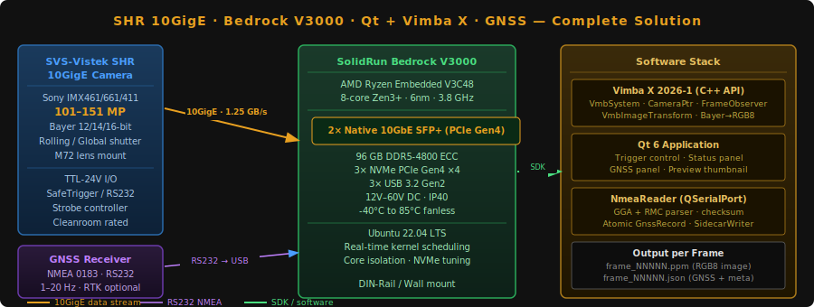

.. _intro:

Introduction
============

|

.. topic:: About This Document

   | **Author:** Luis Viveros
   | **Date:** June 2026
   | **SDK Version:** Vimba X 2026-1
   | **Platform:** SolidRun Bedrock V3000 — Linux (Ubuntu 24.04 LTS)

----

What This Document Covers
--------------------------

This guide describes a **complete industrial machine vision solution** built
from first principles, covering hardware selection, system configuration,
SDK integration, application development, and geolocation tagging.

The solution enables:

- **Ultra-high-resolution image capture** using SVS-Vistek SHR cameras (up to 245 MP)
  over a standard 10GigE Ethernet connection
- **Real-time Qt-based control** for trigger management, acquisition monitoring,
  and live status display
- **Per-frame GNSS geolocation** injected from a serial NMEA receiver,
  tagging every captured image with precise geographic coordinates
- **Production-grade reliability** on the SolidRun Bedrock V3000 fanless
  industrial PC — designed for 24/7 operation in harsh environments

----

The Complete Solution at a Glance
-----------------------------------

.. code-block:: text

   ┌─────────────────────────────────────────────────────────────────────┐
   │                    Complete System Architecture                     │
   ├──────────────────┬──────────────────────────┬───────────────────────┤
   │  HARDWARE LAYER  │    CONNECTIVITY LAYER     │   SOFTWARE LAYER      │
   │                  │                           │                       │
   │  SVS-Vistek SHR  │  10GigE (SFP+)            │  Vimba X 2026-1 SDK  │
   │  10GigE Camera   │  ──────────────────────►  │  (C++ API +           │
   │  101–151 MP      │  up to 1.25 GB/s          │   Image Transform)    │
   │  Bayer 12-bit    │  continuous stream        │                       │
   │                  │                           │  Qt 6 Application     │
   │  GNSS Receiver   │  RS232 → USB adapter      │  (trigger, status,    │
   │  NMEA 0183       │  ──────────────────────►  │   GNSS panel)        │
   │  1–20 Hz fix     │  /dev/ttyUSB0             │                       │
   │                  │                           │  NmeaReader           │
   │  SolidRun        │  Native dual 10GbE SFP+   │  (QSerialPort,        │
   │  Bedrock V3000   │  3× NVMe PCIe Gen4        │   NMEA parser)        │
   │  AMD Ryzen V3000 │  96 GB DDR5 ECC           │                       │
   │  8C Zen3+, 45W   │  -40°C to 85°C fanless    │  SidecarWriter        │
   │  Fanless / IP40  │                           │  (JSON per frame)     │
   └──────────────────┴──────────────────────────┴───────────────────────┘
                                    │
                                    ▼
                      ┌─────────────────────────┐
                      │   Output per frame:     │
                      │   frame_00042.ppm       │
                      │   frame_00042.json      │
                      │   (image + GNSS + meta) │
                      └─────────────────────────┘

----

Solution Components
--------------------

Camera — SVS-Vistek SHR 10GigE Series
^^^^^^^^^^^^^^^^^^^^^^^^^^^^^^^^^^^^^^^

The SVS-Vistek **SHR (Super High Resolution)** cameras are the
highest-resolution industrial cameras in the Allied Vision / TKH Vision
ecosystem, ranging from **101.8 MP to 245.8 MP**. They use large-pixel
Sony CMOS sensors on large-format substrates, delivering image quality
that smaller-pixel high-MP cameras cannot match.

The 10GigE interface transmits raw image data at up to **1.25 GB/s**
continuously over standard Cat 6 Ethernet — no frame grabber required.

**Models covered:** shr461 (101 MP), shr661 (127 MP, global shutter),
shr411 (151 MP, optional TEC cooling), shr811 (245 MP, CXP-12).

Host Platform — SolidRun Bedrock V3000
^^^^^^^^^^^^^^^^^^^^^^^^^^^^^^^^^^^^^^^^

The **Bedrock V3000 Basic** is a compact fanless industrial PC powered
by the AMD Ryzen Embedded V3C48 (8-core Zen3+). Its defining advantage
for this application is **native dual 10GbE SFP+** — the camera's
1.25 GB/s stream connects directly to the SoC's PCIe fabric with no
intermediate hardware.

Supporting this with **96 GB DDR5 ECC RAM** and **three PCIe Gen4 NVMe
slots** makes it the correct match for continuous SHR acquisition: every
frame received is protected by ECC in memory, and can be written to fast
NVMe without saturating a single device.

SDK — Vimba X 2026-1
^^^^^^^^^^^^^^^^^^^^^^

**Vimba X** is Allied Vision's GenICam-compliant SDK. Since release
2024-4 it natively supports SVS-Vistek cameras alongside Allied Vision's
own lineup, enabling mixed-camera applications from a single SDK.

The application uses:

- **Vimba X C++ API** — camera discovery, feature control, asynchronous
  multi-buffer frame acquisition
- **Vimba X Image Transform Library** — Bayer debayering (12-bit → RGB8),
  selectable debayer algorithm, optional colour correction matrix

Qt Application
^^^^^^^^^^^^^^^

The **Qt 6 application** is the control and monitoring layer — it never
touches the data path directly. It provides:

- **Trigger control** — software and hardware trigger enable/disable
- **Acquisition start/stop** — wrapping Vimba X feature commands
- **Parameter configuration** — exposure, gain, pixel format, ROI
- **Live status panel** — frame rate, buffer health, error counts
- **GNSS status panel** — fix quality, coordinates, satellite count
- **Preview** — downsampled thumbnail (not full resolution)

GNSS / NMEA Injection
^^^^^^^^^^^^^^^^^^^^^^

A GNSS receiver connected to the V3000 via **RS232 → USB adapter**
provides a continuous NMEA 0183 sentence stream. A dedicated
``NmeaReader`` thread parses GGA and RMC sentences and maintains an
**atomically-updated shared record** containing latitude, longitude,
altitude, fix quality, and timestamps.

At every ``FrameReceived()`` callback, the acquisition thread snapshots
the current GNSS record atomically — in microseconds, with no mutex
contention — and bundles it with the frame payload. A worker thread
then writes both the image file and a **JSON sidecar** containing full
frame metadata and geolocation.

----

Document Structure
-------------------

.. list-table::
   :header-rows: 1
   :widths: 10 20 70

   * - Part
     - Title
     - What you will learn
   * - **I**
     - The SHR Camera Series
     - All four sensor variants, naming convention, interface options,
       typical applications. Pick the right SHR model for your task.
   * - **II**
     - Host Platform: Bedrock V3000
     - Why continuous GigE Vision streaming demands native 10GbE;
       V3000 specs mapped to SHR requirements; V3000 vs R8000 decision
       rationale; Qt's role as control layer only.
   * - **III**
     - System & SDK Setup
     - Physical connections, OS tuning (MTU, buffers, real-time
       scheduling, NVMe), Vimba X installation, development on a
       generic x86 machine using the Camera Simulator, Qt project setup.
   * - **IV**
     - Building the Application
     - Camera discovery, feature configuration, asynchronous
       acquisition pipeline, image transformation, saving frames.
       External trigger methods: Action Commands (UDP/Ethernet),
       TTL-24V hardware line, and software trigger via Qt.
   * - **V**
     - Complete Application
     - Full annotated C++ source listing, CMakeLists.txt, build
       and run instructions.
   * - **VI**
     - GNSS/NMEA Injection
     - RS232 wiring, NMEA parsing, atomic frame tagging, JSON sidecar
       writer, Qt GNSS panel, testing with simulated NMEA, GeoTIFF export.
   * - **Ref**
     - Reference
     - Troubleshooting guide, complete API quick reference,
       all external links.

----

Prerequisites
--------------

To follow this guide you will need:

.. list-table::
   :header-rows: 0
   :widths: 30 70

   * - **Hardware**
     - SolidRun Bedrock V3000 Basic
       (`product page <https://www.solid-run.com/industrial-computers/bedrock-v3000-basic/>`_)
   * - **Camera**
     - Any SVS-Vistek SHR 10GigE model
       (`product page <https://www.alliedvision.com/en/products/area-scan-cameras/shr/shr-10gige>`_)
   * - **GNSS receiver**
     - Any RS232 NMEA 0183 output receiver (optional for Parts I–V)
   * - **SDK**
     - Vimba X 2026-1
       (`download <https://www.alliedvision.com/en/support/software-downloads/vimba-x-sdk/vimba-x>`_)
   * - **OS**
     - Ubuntu 24.04 LTS (x86_64)
   * - **Compiler**
     - GCC 11+ or Clang 13+ (C++17 required)
   * - **Build tools**
     - CMake 3.16+, Qt 6.8 LTS
   * - **Experience**
     - C++17, basic Linux command line, basic Qt familiarity

----

.. rubric:: Author Note

This documentation was written by **Luis Viveros** in June 2026 as a
comprehensive engineering reference for integrating the SVS-Vistek SHR
10GigE camera series with the SolidRun Bedrock V3000 industrial PC.
It covers the complete development path from hardware selection through
SDK integration to a production-ready Qt application with GNSS geolocation,
intended as a foundation for aerial imaging, inspection, and metrology
systems built on this hardware stack.

All SDK code examples are based on **Vimba X 2026-1** documentation
provided by Allied Vision Technologies GmbH. Hardware specifications
are sourced from SolidRun and SVS-Vistek / Allied Vision published
datasheets current as of June 2026.
